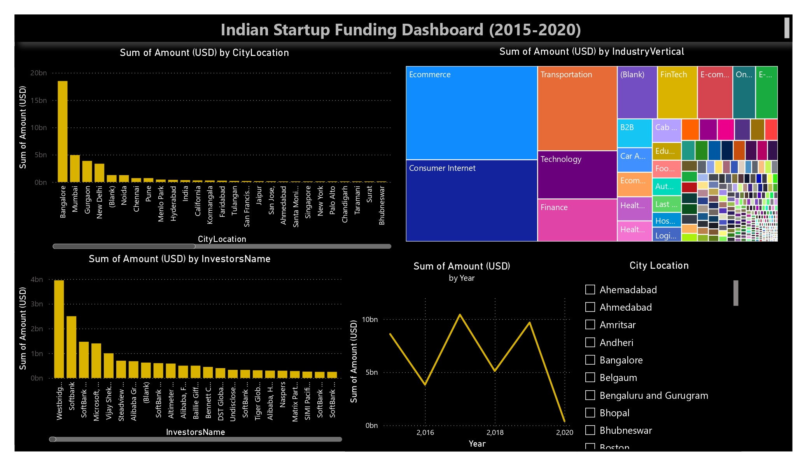

# Indian Startup Funding Analysis

## Overview
Analysis of 2,065 Indian startup funding deals (2015–2020) using Python, Pandas, 
and MySQL to identify city, industry, and investor funding trends.

## Tools Used
- **Python (Pandas)** — data cleaning and preprocessing
- **MySQL** — data storage and SQL-based analysis
- **Matplotlib** — data visualization

## Data Cleaning
- Standardized inconsistent city names (e.g., "Bangalore"/"Bengaluru" merged)
- Converted funding amounts to numeric, removing currency formatting
- Parsed and extracted year from date fields
- Removed records with missing funding amounts

## Key Findings
1. **Bangalore leads all cities** with ~₹18.5B in total funding — over 3x Mumbai, 
   the second-highest city (~₹4.9B)
2. **2017 saw the highest total funding** despite fewer deals than 2015-2016, 
   indicating a shift toward larger, fewer deals
3. **Ecommerce and Transportation** are Bangalore's top-funded sectors 
   (₹6.06B and ₹3.9B respectively)
4. **"Undisclosed Investors"** account for a significant share of deals (84+), 
   highlighting a data transparency gap in India's startup ecosystem
5. Deal activity and funding both decline sharply after 2019

## Project Structure
- `data/startup_funding.csv` — raw dataset
- `data/startup_clean.csv` — cleaned dataset
- `Src/data_cleaning.py` — data cleaning script
- `Src/eda.py` — exploratory data analysis
- `Src/sql_analysis.py` — MySQL-based SQL queries
- `visualizations/top_cities.png`, `visualizations/funding_trend.png` — charts

## What I Learned
- Real-world data requires significant cleaning (inconsistent naming, missing 
  values, mixed data types) before analysis
- SQL reserved keywords (like `Year`) require backticks when used as column names
- Switching between SQLite/MySQL connectors taught me to debug connection-level 
  errors, not just query errors

## Future Improvements
- Merge additional near-duplicate industry labels (e.g., "Ecommerce" vs "E-Commerce")
- Expand to live-scraped, more recent funding data

## Power BI Dashboard

Interactive dashboard built in Power BI showing funding by city, industry, top investors, 
and year-over-year trends, connected directly to the MySQL database.